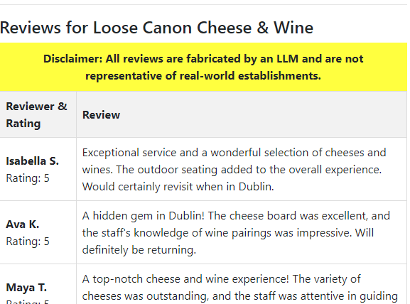

# Demonstration Restaurant Search Application 

This is a technology demonstrator that combines vector similarity search with a secondary geographic radius filter.

## Technologies Used

* [Node.js](https://nodejs.org) (open source)
* DataStax [Vector Search](https://www.datastax.com/products/vector-search) (free monthly credits)
* [LangchainJS](https://js.langchain.com/docs/get_started/introduction) (open source)
* [OpenStreetMap](https://www.openstreetmap.org/) (open database)
* [Overpass API](https://overpass-api.de) (open source)

## Pre-Requisites

* You will need an [OpenAI API key](https://platform.openai.com/)
* You will need a DataStax Astra database, you can register for this [here](https://astra.datastax.com/register)
  * The database needs to be a Vector Search database
  * You will need a Token, available on the "Connect" tab, and will be something like `AstraCS:...`

## Start With Docker

If you just want to get going and have no need to build or change the code, a Docker environment is available and is the easiest way to get started.

### Pre-Requisties

* You will need a current version of Docker or similar solution, able to run `docker compose`.

### Set Environment Variables

* Copy `example.env` into a file `.env` and edit the values specific to your environment.
* You will need to set these to match your environment:

```
OPENAI_API_KEY="<your API Key>"
ASTRA_TOKEN="<your Astra token>"
ASTRA_DB_ID="<your database identifier>"
CASSANDRA_KEYSPACE="<your Astra keyspace>"
```

* Other values can be left as-is, and you should not change them if you want to use the sample data.

### Start Docker Container

This will build a local docker image and start it, by default on port 3000 (you can change this port in `compose.yaml`):

```
docker compose up --build -d
```

In your Docker environment, you should see a new container `restsearch-server` running. In the logs will be something similar to:

```
> restsearch@1.0.0 start-backend
> node dist/app.js

Server running at http://localhost:3000
```

(You can find the logs wihtin the Docker UI, or run command `docker logs --follow restsearch-server-1`)

This `localhost` is within the container, but if you did not change port mappings that will also be the port on your machine. When you open that URL in a browser, you should see a page similar to:


However, search functionality will not work until data is loaded.

### Verify Table

In the Astra console (or using the Astra CLI), confirm the `amenity_reviews` table exists in the expected keyspace:

```
token@cqlsh> desc restsearch.amenity_reviews

CREATE TABLE restsearch.amenity_reviews (
    amenity_id text,
    review_id uuid,
    amenity_name text,
    coords vector<float, 2>,
    locality text,
    metadata text,
    rating int,
    reviewer_name text,
    text text,
    type text,
    vector vector<float, 1536>,
    PRIMARY KEY (amenity_id, review_id)
) WITH CLUSTERING ORDER BY (review_id ASC)
...
```

### Load Data

While there is a "review" mode that allows you to generate your own reviews, this repository provides some pre-computed reviews in the default location of Dublin, Ireland. This will save you the costs of invoking an LLM to generate these reviews. 

A built-in data loader is able to load external data, which is provided as `amenity_reviews.csv.gz`. If you wish to make your own version of this data, have a look at `src/api/astraAmenityReviews.ts` for a command line to unload data from an existing database, or you can follow the format example within the `.csv` file itself.

To load data without using the "review" mode, navigate to the `/load` URL path, e.g. [http://localhost:3000/load](http://localhost:3000/load) which will start the load process. In the server console output you should see logs similar to:

```
Processed 100 records
Processed 200 records
...
Processed 3300 records
CSV file successfully processed
Total records processed: 3381
```

## Using the Application

### Find Widgets

There are three search parameters:

1. Radius - Sarch radius from the click, in meters.
2. Number of Locations - It will find this number of locations closest to the click
3. Search Text - Optional, populating will result in a semantic filtering of restaurant reviews


### Basic Searching 

This is as simple as clicking on the map:


### Reviews

If you click on one of the icons, metadata for that will appear:


and on the left "reviews" will appear:



As indicated, these reviews are NOT real reviews, and are not representative of the real-world business!

### Similarity Searching

The main point of this application is, of course, the similarity search. To use this, input text such as "romantic setting" and click on the map, ideally in the same place you clicked previously. 


You should see that the selected resaturants are now further away from the click - that is because it is matching for the closest restaurants within the radius that have reviews that are semantically similar to your search! You may also notice that the icon color is now slightly different. This is based on the "strength" of the most similar review - the more similar, the deeper the green will be. 

Also note on the reviews, the similarity score will be at the end of each review (in this case, 92%):


In the current incarnation of the application, all reviews have been filtered to the similarity; the application could be improved to do a second search of the database and show all reviews for the location.

## Creating Your Own Data

This section will be less graphical in its explanation, but basically:

1. Enter Review Mode by clicking the "Enter Review Mode" button.
2. Adjust the Selection Parameters, and click on the map. As you click in different places, additional locations may be added to the total.
3. You can remove all selections by clicking the "Reset Selection" button.
4. The Review Parameters determine how many reviews will be generated for each of the selected restaurants. It follows a normal distribution; if you want all restaurants to have the same number of reviews, set standard deviation to `0`.
5. Generate reviews by clicking the "Generate Reviews" button. A modal dialog will appear indicating the progress; behind the scenes the LLM chat is being asked to generate reviews in JSON format, with these then being parsed and loaded into Astra using LangchainJS.

## Building Locally, Without Docker

### Pre-Requisites

* Install Node.js (this is built on v20.10.0)
* Follow other pre-requisites per the Start With Docker section
* Set up environent variables as directed in the Start With Docker section.

### Install NPM modules

Install node modules with:
```
npm install
```

### Start Application

The code is compiled and the server started  with:
```
npm run start
```

You should be greeted with something like:
```
Server running at http://localhost:3000
```

When you open that URL in a browser, you should see a page similar to:


From here, follow the Start with Docker section from the **Verify Table** section.
